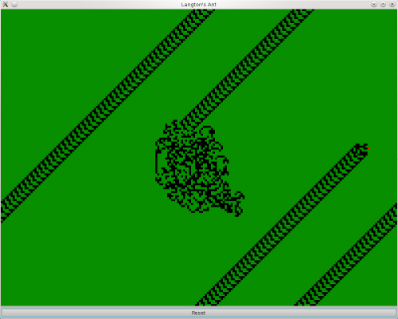
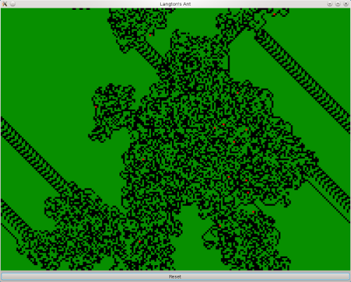

# Langton's Ant in Haskell

## Summary
This is an implementation of the famous cellular automaton.

Details can be found here:
[http://en.wikipedia.org/wiki/Langton's_ant](http://en.wikipedia.org/wiki/Langton's_ant)

The first ant starts in the middle of the region. But you can add more ants by clicking on the canvas.

## UI
The program uses the library **Gtk2Hs** to render the simulation on a canvas.

## Screenshots

### One ant

### Multiple ants

